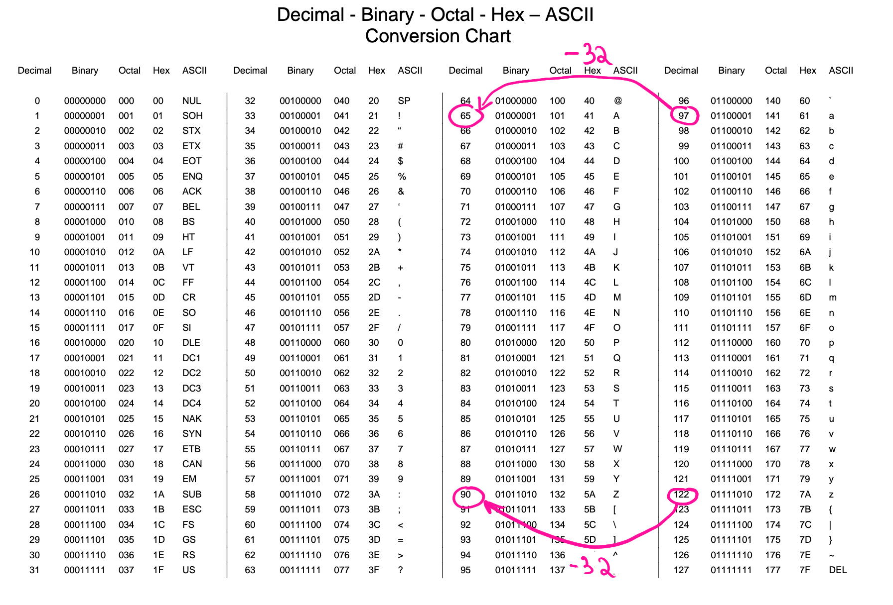
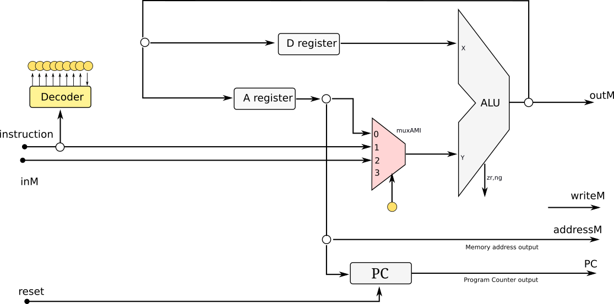

# 21a - AV3 

Avaliação 3 de Elementos de Sistemas.  

- **Trabalhar sozinho**
- **120 minutos**
- **Ficar conectado no canal geral (para ouvir instruções)**

## Prática

Resolva no Linux e lembre de:

1. clonar o seu repositório (e trabalhar nele)
1. editar o arquivo `ALUNO.json`
1. não esqueça de dar `commit` e `push`

As questões de hardware (`.vhd`) devem ser implementadas nos arquivos localizados na pasta `src/rtl`, as questões de software (`nasm`) devem ser implementadas nos arquivos localizados em `src/nasm`. Os scripts a seguir testam respectivamente a parte de hardware e software:

```
./testeHW.py
./testeAssembly.py
```

> Vocês devem editar o arquivo `config_testes.txt` selecionando o que desejam testar.

**LEMBRE DE REALIZAR UM COMMIT (A CADA QUESTÃO) E DAR PUSH AO FINALIZAR**

## 1. (20 SW) pseudo

| Arquivo: `/src/nasm/pseudo.nasm` | pts HW | pts SW |
|----------------------------------|--------|--------|
| Teste 0: while                   |        | 5      |
| Teste 1: else                    |        | 5      |
| Teste 2: if                      |        | 5      |

Transcreva para assembly do Z01 o pseudo código a seguir:

```python
while RAM[2] > 4
    RAM[1] = RAM[1] + RAM[1]
    RAM[2] = RAM[2] - 1
if RAM[1] == 8:
    RAM[3] = 1
else:
    RAM[3] = 0
```

## 2. (10 SW) Cálculo de reta

| Arquivo: `/src/nasm/reta.nasm` | pts HW | pts SW |
|--------------------------------|--------|--------|
| teste 0: teste único           |        | 10     |

Dado a equação de reta a seguir:        

`y = mx + b`

Sendo:

- y: RAM[0]
- x: RAM[1]
- m: RAM[2]
- b: RAM[3]

Calcule o valor do ponto `y` dado os demais valores.

> Dica: Reaproveite mult.nasm

## 3. (25 SW) AlTERando CaIxA dE CAraCteRes

| Arquivo: `/src/nasm/uppsercase.nasm` | pts HW | pts SW |
|--------------------------------------|--------|--------|
| Teste 0: string exemplo              |        | 5      |
| Teste 1: string tamanho diferente    |        | 10     |
| Teste 2: string com números          |        | 10     |

Você deve desenvolver um programa em assembly que converte
todos os caracteres de uma string para maiúsculo. Conforme
exemplo a seguir (string começa na RAM[8]):

``` 
teste 0
   antes          |    depois
                  |
 RAM[8]  = `H`    |     `H`
 RAM[9]  = `e`    |     `E`
 RAM[10] = `L`   ==>    `L`
 RAM[11] = `l`    |     `L`
 RAM[12] =  o`    |      O`
 RAM[13] = 0x00   |    0x00
```

Dicas:

- Notem que o **A** tem uma distância para o **a** e que se mantém para as outras letras.
- Antes de subtrair o valor da distância da letra, precisa verificar se ela é minuscula.



## 4. CPU - Mux AMI

Um colega do seu grupo teve a ideia de modificar a CPU do Z01
removendo o MUXALUI_A e modificando o MUXAM, colocando um de
quatro entradas no lugar recebendo os sinais: A_OUT, Instruction e 



#### a) questao4.txt

| Arquivo:  `/src/vhd/questao4.txt` | pts HW | pts SW |
|-----------------------------------|--------|--------|
| Responda a pergunta               | 5      | 0      |

Explique no arquivo questao4.txt qual a ideia do seu colega, é uma modificação boa? Ela acrescenta ou remove funcionalidades da CPU, quais? Explique!

#### b) controlUnit4.vhd

| Arquivo: `/src/vhd/controlUnit4.vhd` | pts HW | pts SW |
|--------------------------------------|--------|--------|
| Teste único                          | 5      | 0      |

O arquivo `controlUnit4.vhd` possui no lugar dos sinal dos mux (MUXALUI, MUXAM) apenas o sinal de controle do mux novo: MUXAIM. Implemente **somente** a lógica de controle do seletor deste novo mux. 

## 5. Novo salto

| Arquivo: `/src/vhd/instrucao5.vhd` | pts HW | pts SW |
|------------------------------------|--------|--------|
| Sem teste                          | 5      | 0      |

Os saltos no nosso Z01.1 são sempre referentes ao ZERO (`%d > 0`, `%d < 0`, `%d==0`, ...), mas isso não é uma limitação do nosso HW. Podemos executar saltos em realação ao **1** (`%d > 1`, `%d < 1`, `%d==1`, ...) sem termos que modificar nada no nosso hardware.

Como seria a instrução em linguagem de máquina para verificar se `%D > 1`? Indique a resposta no arquivo `instrucao5.vhd`


